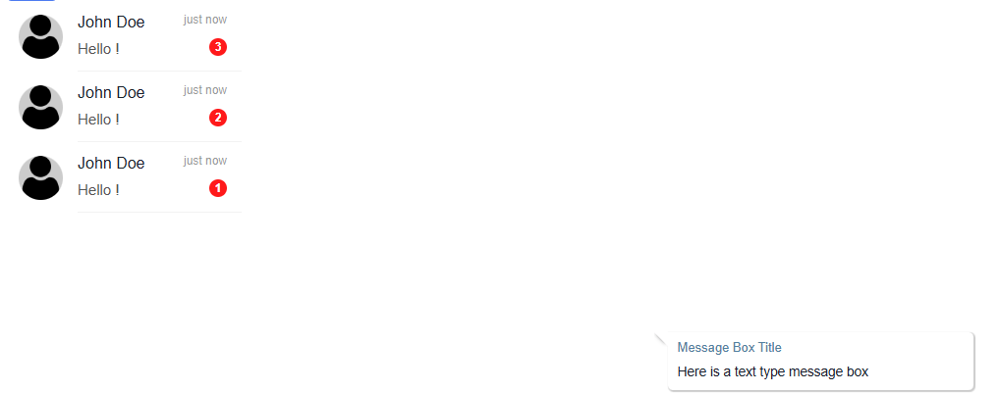

# Overview

This Chat Component is designed for real-time communication using WebSockets. It's ideal for integrating live chat features into web applications, enabling users to send and receive messages instantly.

## Chat component

## QodlySource

| Name              | Type   | Required | Description                                                                                                                                                     |
| ----------------- | ------ | -------- | --------------------------------------------------------------------------------------------------------------------------------------------------------------- |
| Qodlysource       | entity | Yes      | Will contain the connected user entity that will be used to get the messages and enable the websocket login                                                     |
| Display attribute | String | Yes      | The user attribute that will be used for displaying the conversation , users and messages and which will be used in the messaging sending and receiving process |

## Properties

| Name   | Type   | Required | Description                                                                                            |
| ------ | ------ | -------- | ------------------------------------------------------------------------------------------------------ |
| Socket | String | Yes      | The socket address (ws://socketURL or wss://socketURL) to which our websocket server will be connected |
